## 1、K8s快速入门
### 1）简介
kubernetes简称k8s。是用于自动部署，扩展和管理容器化应用程序的开源系统。
中文官网：https://kubernetes.io/Zh/
中文社区：https://www.kubernetes.org.cn/
官方文档：https://kubernetes.io/zh/docs/home/
社区文档：https://docs.kubernetes.org.cn/

部署方式的进化：

  


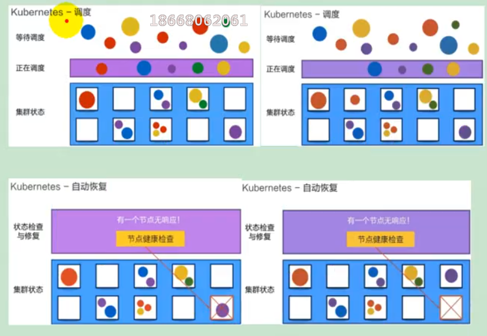


### 2）架构

#### （1）整体主从方式

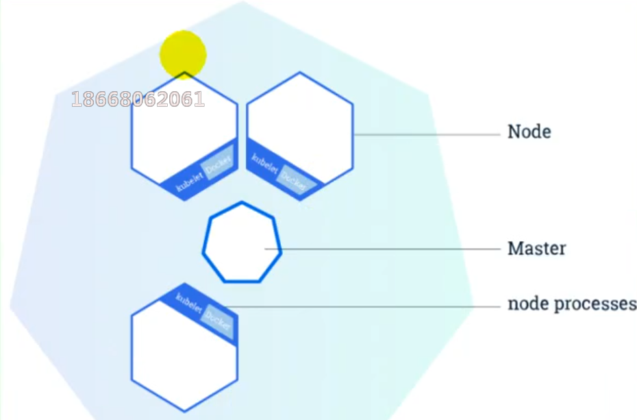


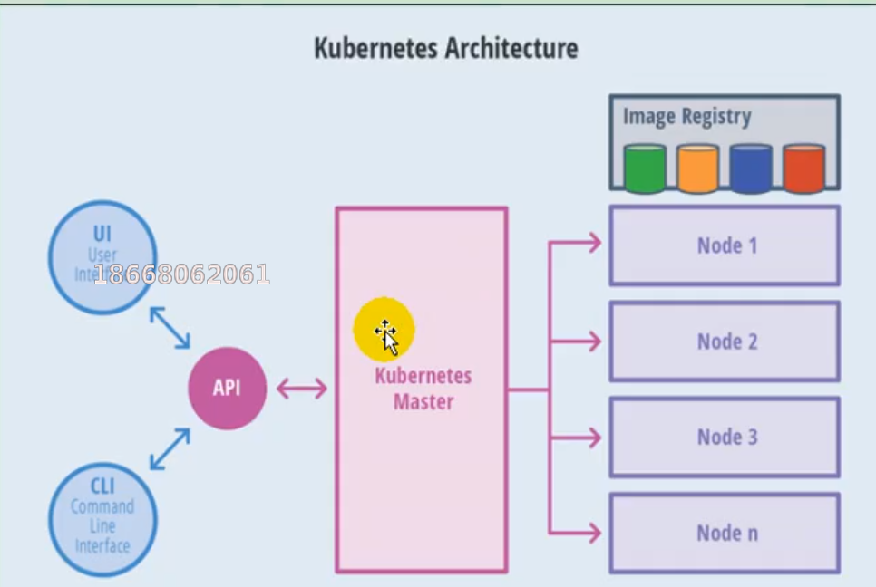


#### （2）master节点架构

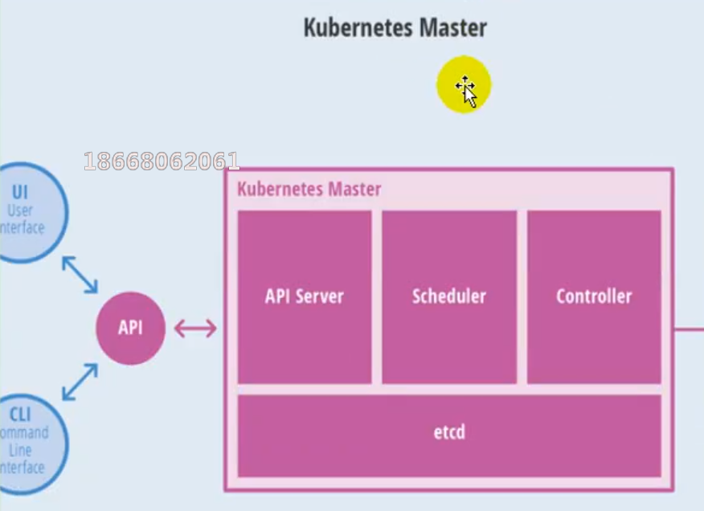

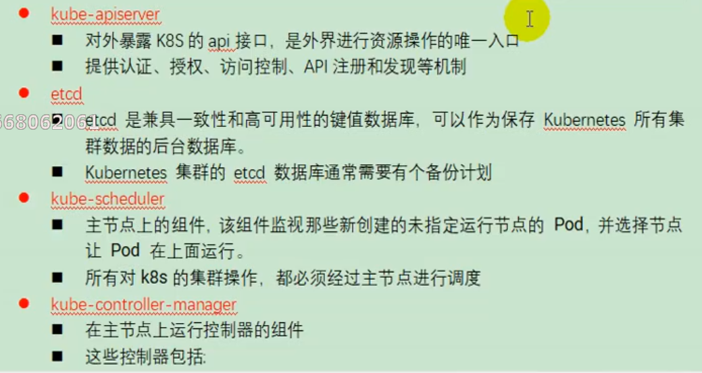


#### （3）Node节点架构

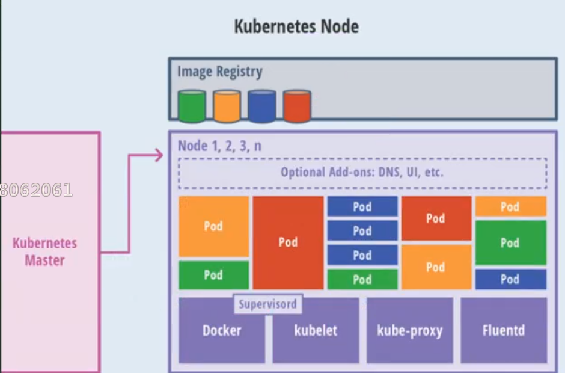

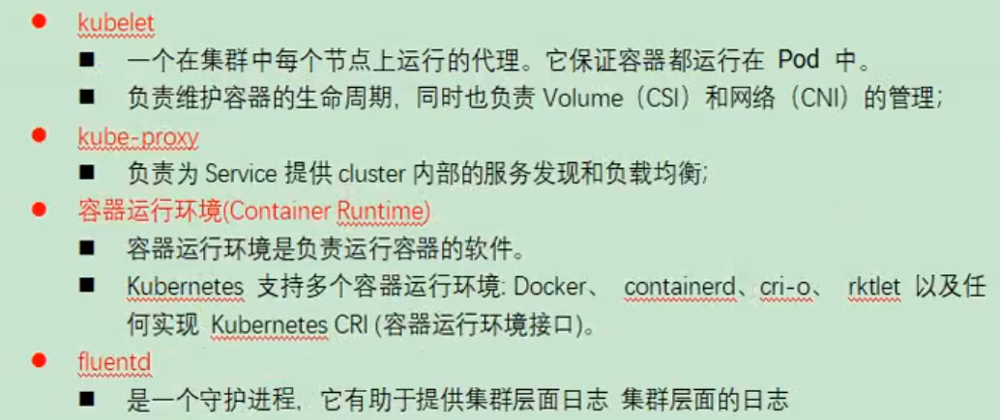


### 3）概念

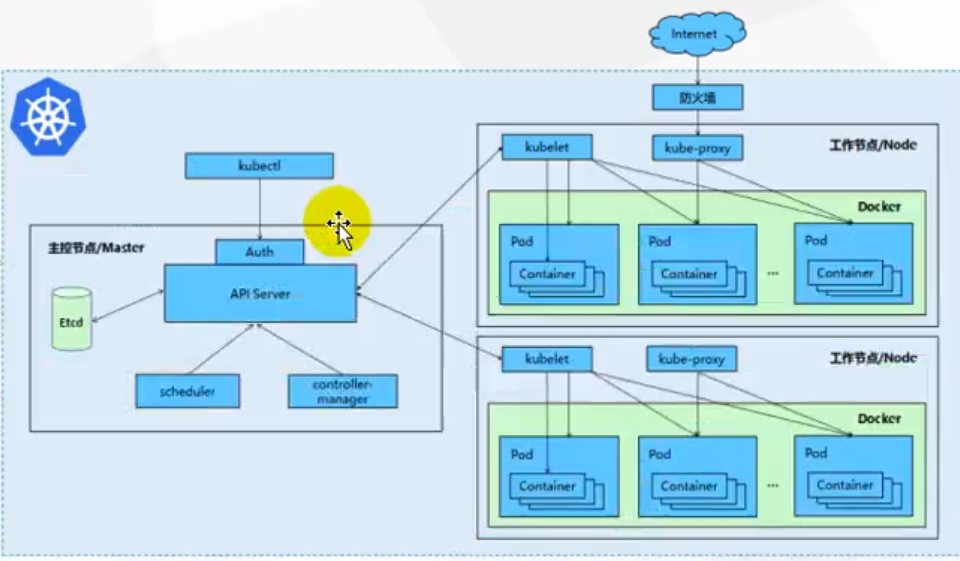

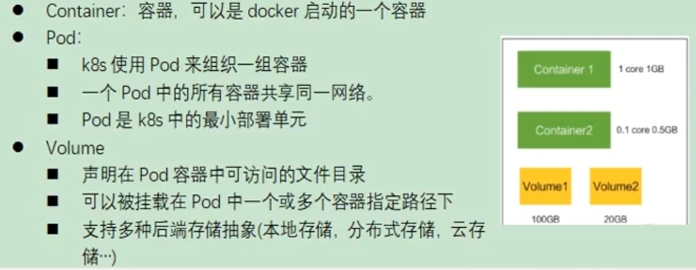


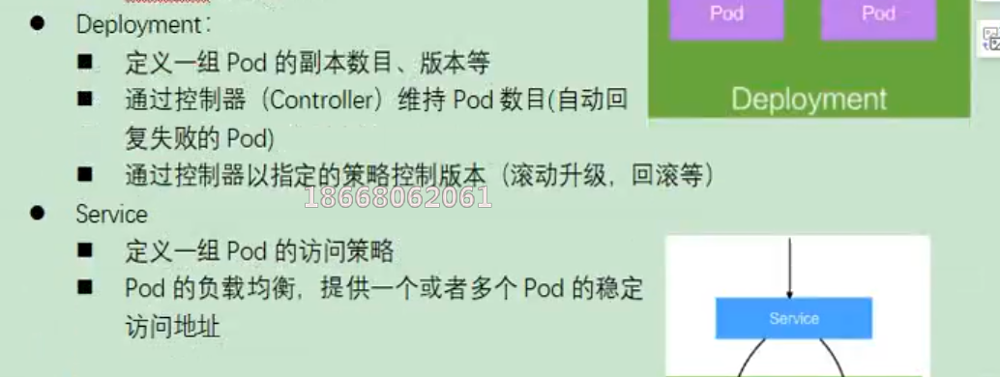

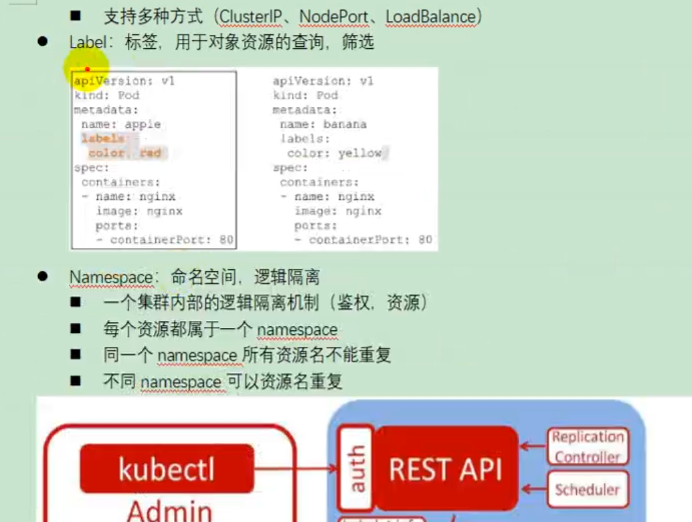

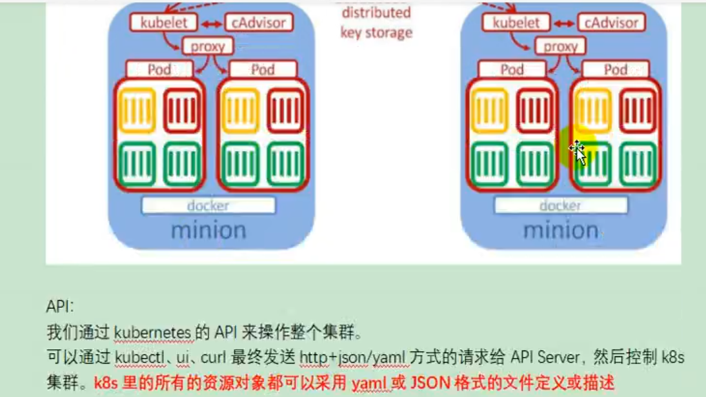

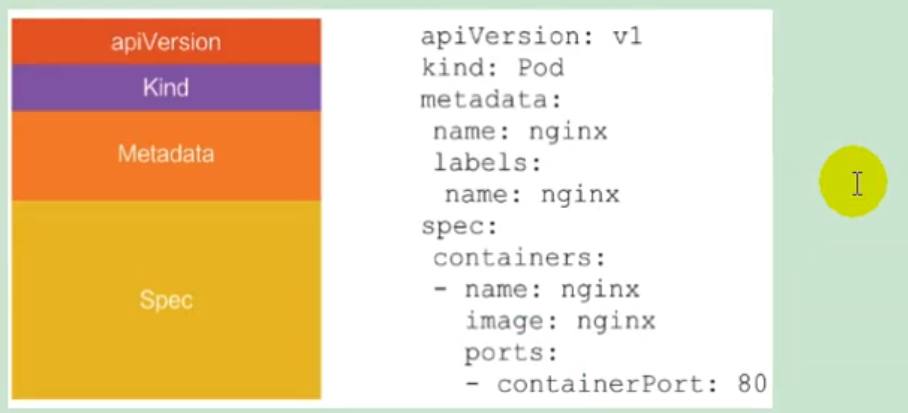


### 4）快速体验

 

#### （1）安装minikube

https://github.com/kubernetes/minikube/releases
下载minikuber-windows-amd64.exe 改名为minikube.exe
打开virtualBox，打开cmd
运行
minikube start --vm-driver=virtualbox --registry-mirror=https://registry.docker-cn.com
等待20分钟即可。

#### （2）体验nginx部署升级

1. 提交一个nginx deployment
kubectl apply -f https://k8s.io/examples/application/deployment.yaml

2. 升级 nginx deployment
kubectl apply -f https://k8s.io/examples/application/deployment-update.yaml

3. 扩容 nginx deployment


## 2、K8s集群安装

### 1）kubeadm

kubeadm是官方社区推出的一个用于快速部署kuberneters集群的工具。
这个工具能通过两条指令完成一个kuberneters集群的部署

创建一个master节点

```
$ kuberneters init
```

将一个node节点加入到当前集群中

```
$ kubeadm join <Master节点的IP和端口>
```


### 2）前置要求

一台或多台机器，操作系统Centos7.x-86_x64
硬件配置：2GB或更多RAM，2个CPU或更多CPU，硬盘30GB或更多
集群中所有的机器之间网络互通
可以访问外网，需要拉取镜像
禁止Swap分区

### 3）部署步骤

1. 在所有的节点上安装Docker和kubeadm
2. 不是Kubernetes Master
3. 部署容器网络插件
4. 部署Kubernetes Node，将节点加入Kubernetes集群中
5. 部署DashBoard web页面，可视化查看Kubernetes资源

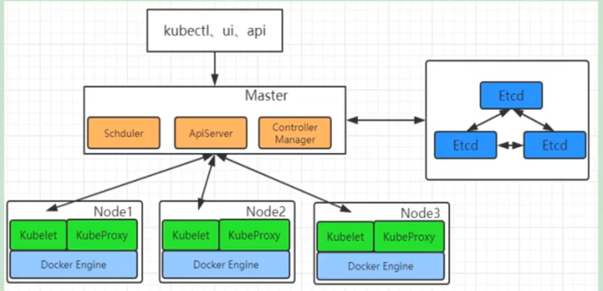

### 4）环境准备

#### （1）准备工作

* 我们可以使用vagrant快速创建三个虚拟机。虚拟机启动前先设置virtualbox的主机网络。现在全部统一为192.168.56.1，以后所有虚拟机都是56.x的ip地址。

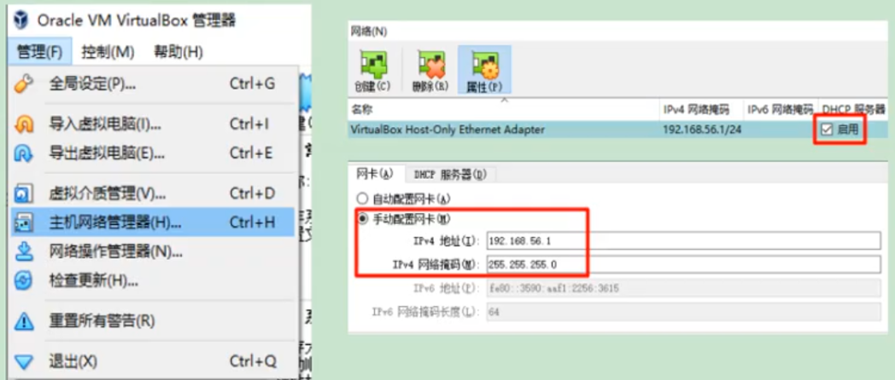


* 在全局设定中，找到一个空间比较大的磁盘用用来存放镜像。 

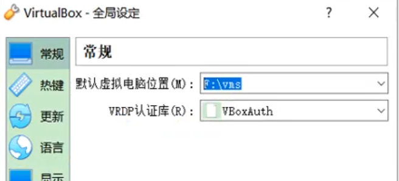


#### （2）启动三个虚拟机


* 使用我们提供的vagrant文件，复制到非中文无空格目录下，运行vagrant up启动三个虚拟机。其实vagrant完全可以一键部署全部K8s集群
  https://github.com/rootsongjc/kubernetes-vagrant-centos-cluster
  http://github.com/davidkbainbridge/k8s-playground

下面是vagrantfile，使用它来创建三个虚拟机，分别为k8s-node1，k8s-node2和k8s-node3.

```yaml
Vagrant.configure("2") do |config|
   (1..3).each do |i|
        config.vm.define "k8s-node#{i}" do |node|
            # 设置虚拟机的Box
            node.vm.box = "centos/7"

            # 设置虚拟机的主机名
            node.vm.hostname="k8s-node#{i}"

            # 设置虚拟机的IP
            node.vm.network "private_network", ip: "192.168.56.#{99+i}", netmask: "255.255.255.0"

            # 设置主机与虚拟机的共享目录
            # node.vm.synced_folder "~/Documents/vagrant/share", "/home/vagrant/share"

            # VirtaulBox相关配置
            node.vm.provider "virtualbox" do |v|
                # 设置虚拟机的名称
                v.name = "k8s-node#{i}"
                # 设置虚拟机的内存大小
                v.memory = 4096
                # 设置虚拟机的CPU个数
                v.cpus = 4
            end
        end
   end
end
```


* 进入到三个虚拟机，开启root的密码访问权限

```shell
Vagrant ssh xxx进入到系统后

su root 密码为vagrant

vi /etc/ssh/sshd_config

修改
PermitRootLogin yes 
PasswordAuthentication yes

所有的虚拟机设为4核4G
#重启sshd服务
service sshd restart
```


关于在"网络地址转换"的连接方式下，三个节点的eth0，IP地址相同的问题。

**问题描述：**查看k8s-node1的路由表：

```
[root@k8s-node1 ~]# ip route show
default via 10.0.2.2 dev eth0 proto dhcp metric 100 
10.0.2.0/24 dev eth0 proto kernel scope link src 10.0.2.15 metric 100 
192.168.56.0/24 dev eth1 proto kernel scope link src 192.168.56.100 metric 101 
[root@k8s-node1 ~
```

能够看到路由表中记录的是，通过端口eth0进行数据包的收发。

分别查看k8s-node1，k8s-node2和k8s-node3的eth0所绑定的IP地址，发现它们都是相同的，全都是10.0.2.15，这些地址是供kubernetes集群通信用的，区别于eth1上的IP地址，是通远程管理使用的。

```shell
[root@k8s-node1 ~]# ip addr
...
2: eth0: <BROADCAST,MULTICAST,UP,LOWER_UP> mtu 1500 qdisc pfifo_fast state UP group default qlen 1000
    link/ether 52:54:00:8a:fe:e6 brd ff:ff:ff:ff:ff:ff
    inet 10.0.2.15/24 brd 10.0.2.255 scope global noprefixroute dynamic eth0
       valid_lft 84418sec preferred_lft 84418sec
    inet6 fe80::5054:ff:fe8a:fee6/64 scope link 
       valid_lft forever preferred_lft forever
3: eth1: <BROADCAST,MULTICAST,UP,LOWER_UP> mtu 1500 qdisc pfifo_fast state UP group default qlen 1000
    link/ether 08:00:27:a3:ca:c0 brd ff:ff:ff:ff:ff:ff
    inet 192.168.56.100/24 brd 192.168.56.255 scope global noprefixroute eth1
       valid_lft forever preferred_lft forever
    inet6 fe80::a00:27ff:fea3:cac0/64 scope link 
       valid_lft forever preferred_lft forever
[root@k8s-node1 ~]# 
```

**原因分析：**这是因为它们使用是端口转发规则，使用同一个地址，通过不同的端口来区分。但是这种端口转发规则在以后的使用中会产生很多不必要的问题，所以需要修改为NAT网络类型。

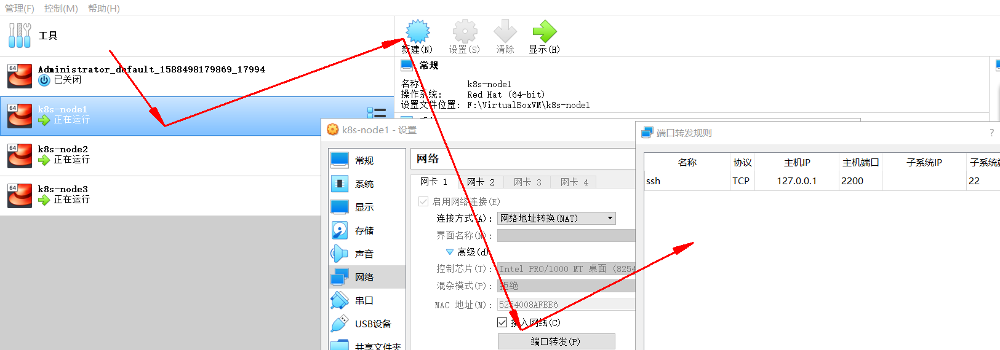

**解决方法：**

* 选择三个节点，然后执行“管理”->"全局设定"->“网络”，添加一个NAT网络。


* 分别修改每台设备的网络类型，并刷新重新生成MAC地址。


* 再次查看三个节点的IP （ip addr）


* 彼此能够ping通，并可以ping baidu.com也通


#### （3）设置Linux环境（三个节点都执行）

* 关闭防火墙

```shell
systemctl stop firewalld
systemctl disable firewalld
```

* 关闭selinux，Linux默认的安全策略

```
sed -i 's/enforcing/disabled/' /etc/selinux/config
setenforce 0
```

* 关闭swap 

```shell
swapoff -a #临时关闭
sed -ri 's/.*swap.*/#&/' /etc/fstab #永久关闭
free -g #验证，swap必须为0
```

* 添加主机名与IP对应关系：

查看主机名：

```
hostname
```

如果主机名不正确，可以通过“hostnamectl set-hostname \<newhostname\> :指定新的hostname”命令来进行修改。


```shell
vi /etc/hosts
10.0.2.15 k8s-node1
10.0.2.4 k8s-node2
10.0.2.5 k8s-node3
```


将桥接的IPV4流量传递到iptables的链：

```shell
cat > /etc/sysctl.d/k8s.conf <<EOF

net.bridge.bridge-nf-call-ip6tables = 1

net.bridge.bridge-nf-call-iptables = 1

EOF
```

应用规则：

```
sysctl --system
```


疑难问题：遇见提示是只读的文件系统，运行如下命令

```
mount -o remount rw /
```

* date 查看时间（可选）

```shell
yum -y install ntpupdate

ntpupdate time.window.com #同步最新时间
```

+ 备份虚拟机

### 5）所有节点安装docker、kubeadm、kubelet、kubectl

Kubenetes默认CRI（容器运行时）为Docker，因此先安装Docker。

#### （1）安装Docker

1、卸载之前的docker

```
$ sudo yum remove docker \
                  docker-client \
                  docker-client-latest \
                  docker-common \
                  docker-latest \
                  docker-latest-logrotate \
                  docker-logrotate \
                  docker-engine
```

2、安装Docker  -CE

```shell
$ sudo yum install -y yum-utils
#设置docker repo的yum位置
$ sudo yum-config-manager \
    --add-repo \
    https://download.docker.com/linux/centos/docker-ce.repo
#安装Docker  -y是自动确认
$ sudo yum -y install docker-ce docker-ce-cli containerd.io   
```

3、配置镜像加速

```shell
sudo mkdir -p /etc/docker
sudo tee /etc/docker/daemon.json <<-'EOF'
{
  "registry-mirrors": ["https://ke9h1pt4.mirror.aliyuncs.com"]
}
EOF
sudo systemctl daemon-reload
sudo systemctl restart docker
```

4、启动Docker && 设置docker开机启动

```shell
systemctl enable docker
```


基础环境准备好，可以给三个虚拟机备份一下；


#### （2）添加阿里与Yum源

```shell
cat <<EOF > /etc/yum.repos.d/kubernetes.repo
[kubernetes]
name=Kubernetes
baseurl=https://mirrors.aliyun.com/kubernetes/yum/repos/kubernetes-el7-x86_64/
enabled=1
gpgcheck=1
repo_gpgcheck=1
gpgkey=https://mirrors.aliyun.com/kubernetes/yum/doc/yum-key.gpg https://mirrors.aliyun.com/kubernetes/yum/doc/rpm-package-key.gpg
EOF
```

更多详情见： https://developer.aliyun.com/mirror/kubernetes 

#### （3）安装kubeadm，kubelet和kubectl

```
yum list|grep kube
```

安装，指定版本

```shell
yum install -y kubelet-1.17.3 kubeadm-1.17.3 kubectl-1.17.3
```

开机启动

```shell
systemctl enable kubelet && systemctl start kubelet
```


查看kubelet的状态：

```
systemctl status kubelet
```

查看kubelet版本：

```shell
[root@k8s-node2 ~]# kubelet --version
Kubernetes v1.17.3
```


### 6）部署k8s-master

#### （1）master节点初始化

在Master节点上，创建并执行master_images.sh

```sh
#!/bin/bash

images=(
	kube-apiserver:v1.17.3
    kube-proxy:v1.17.3
	kube-controller-manager:v1.17.3
	kube-scheduler:v1.17.3
	coredns:1.6.5
	etcd:3.4.3-0
    pause:3.1
)

for imageName in ${images[@]} ; do
    docker pull registry.cn-hangzhou.aliyuncs.com/google_containers/$imageName
#   docker tag registry.cn-hangzhou.aliyuncs.com/google_containers/$imageName  k8s.gcr.io/$imageName
done
```


初始化kubeadm

```shell
$ kubeadm init \
--apiserver-advertise-address=10.0.2.15 \
--image-repository registry.cn-hangzhou.aliyuncs.com/google_containers \
--kubernetes-version   v1.17.3 \
--service-cidr=10.96.0.0/16  \
--pod-network-cidr=10.244.0.0/16
```

注：

* --apiserver-advertise-address=10.0.2.21 ：这里的IP地址是master主机的地址，为上面的eth0网卡的地址；
* 

执行结果：

```shell
[root@k8s-node1 opt]# kubeadm init \
> --apiserver-advertise-address=10.0.2.15 \
> --image-repository registry.cn-hangzhou.aliyuncs.com/google_containers \
> --kubernetes-version   v1.17.3 \
> --service-cidr=10.96.0.0/16  \
> --pod-network-cidr=10.244.0.0/16
W0503 14:07:12.594252   10124 configset.go:202] WARNING: kubeadm cannot validate component configs for API groups [kubelet.config.k8s.io kubeproxy.config.k8s.io]
[init] Using Kubernetes version: v1.17.3
[preflight] Running pre-flight checks
        [WARNING IsDockerSystemdCheck]: detected "cgroupfs" as the Docker cgroup driver. The recommended driver is "systemd". Please follow the guide at https://kubernetes.io/docs/setup/cri/
[preflight] Pulling images required for setting up a Kubernetes cluster
[preflight] This might take a minute or two, depending on the speed of your internet connection
[preflight] You can also perform this action in beforehand using 'kubeadm config images pull'
[kubelet-start] Writing kubelet environment file with flags to file "/var/lib/kubelet/kubeadm-flags.env"
[kubelet-start] Writing kubelet configuration to file "/var/lib/kubelet/config.yaml"
[kubelet-start] Starting the kubelet
[certs] Using certificateDir folder "/etc/kubernetes/pki"
[certs] Generating "ca" certificate and key
[certs] Generating "apiserver" certificate and key
[certs] apiserver serving cert is signed for DNS names [k8s-node1 kubernetes kubernetes.default kubernetes.default.svc kubernetes.default.svc.cluster.local] and IPs [10.96.0.1 10.0.2.15]
[certs] Generating "apiserver-kubelet-client" certificate and key
[certs] Generating "front-proxy-ca" certificate and key
[certs] Generating "front-proxy-client" certificate and key
[certs] Generating "etcd/ca" certificate and key
[certs] Generating "etcd/server" certificate and key
[certs] etcd/server serving cert is signed for DNS names [k8s-node1 localhost] and IPs [10.0.2.15 127.0.0.1 ::1]
[certs] Generating "etcd/peer" certificate and key
[certs] etcd/peer serving cert is signed for DNS names [k8s-node1 localhost] and IPs [10.0.2.15 127.0.0.1 ::1]
[certs] Generating "etcd/healthcheck-client" certificate and key
[certs] Generating "apiserver-etcd-client" certificate and key
[certs] Generating "sa" key and public key
[kubeconfig] Using kubeconfig folder "/etc/kubernetes"
[kubeconfig] Writing "admin.conf" kubeconfig file
[kubeconfig] Writing "kubelet.conf" kubeconfig file
[kubeconfig] Writing "controller-manager.conf" kubeconfig file
[kubeconfig] Writing "scheduler.conf" kubeconfig file
[control-plane] Using manifest folder "/etc/kubernetes/manifests"
[control-plane] Creating static Pod manifest for "kube-apiserver"
[control-plane] Creating static Pod manifest for "kube-controller-manager"
W0503 14:07:30.908642   10124 manifests.go:225] the default kube-apiserver authorization-mode is "Node,RBAC"; using "Node,RBAC"
[control-plane] Creating static Pod manifest for "kube-scheduler"
W0503 14:07:30.911330   10124 manifests.go:225] the default kube-apiserver authorization-mode is "Node,RBAC"; using "Node,RBAC"
[etcd] Creating static Pod manifest for local etcd in "/etc/kubernetes/manifests"
[wait-control-plane] Waiting for the kubelet to boot up the control plane as static Pods from directory "/etc/kubernetes/manifests". This can take up to 4m0s
[apiclient] All control plane components are healthy after 22.506521 seconds
[upload-config] Storing the configuration used in ConfigMap "kubeadm-config" in the "kube-system" Namespace
[kubelet] Creating a ConfigMap "kubelet-config-1.18" in namespace kube-system with the configuration for the kubelets in the cluster
[upload-certs] Skipping phase. Please see --upload-certs
[mark-control-plane] Marking the node k8s-node1 as control-plane by adding the label "node-role.kubernetes.io/master=''"
[mark-control-plane] Marking the node k8s-node1 as control-plane by adding the taints [node-role.kubernetes.io/master:NoSchedule]
[bootstrap-token] Using token: sg47f3.4asffoi6ijb8ljhq
[bootstrap-token] Configuring bootstrap tokens, cluster-info ConfigMap, RBAC Roles
[bootstrap-token] configured RBAC rules to allow Node Bootstrap tokens to get nodes
[bootstrap-token] configured RBAC rules to allow Node Bootstrap tokens to post CSRs in order for nodes to get long term certificate credentials
[bootstrap-token] configured RBAC rules to allow the csrapprover controller automatically approve CSRs from a Node Bootstrap Token
[bootstrap-token] configured RBAC rules to allow certificate rotation for all node client certificates in the cluster
[bootstrap-token] Creating the "cluster-info" ConfigMap in the "kube-public" namespace
[kubelet-finalize] Updating "/etc/kubernetes/kubelet.conf" to point to a rotatable kubelet client certificate and key
[addons] Applied essential addon: CoreDNS
[addons] Applied essential addon: kube-proxy
#表示kubernetes已经初始化成功了
Your Kubernetes control-plane has initialized successfully!

To start using your cluster, you need to run the following as a regular user:

  mkdir -p $HOME/.kube
  sudo cp -i /etc/kubernetes/admin.conf $HOME/.kube/config
  sudo chown $(id -u):$(id -g) $HOME/.kube/config

You should now deploy a pod network to the cluster.
Run "kubectl apply -f [podnetwork].yaml" with one of the options listed at:
  https://kubernetes.io/docs/concepts/cluster-administration/addons/

Then you can join any number of worker nodes by running the following on each as root:

kubeadm join 10.0.2.15:6443 --token 0b5o6a.bskxuzv6fx5yxzir \
    --discovery-token-ca-cert-hash sha256:12528ef8162eb0601b9ad0da8daaeafc221c9897b9964020659440b13fdb55fa
[root@k8s-node1 opt]# 
```


由于默认拉取镜像地址k8s.cr.io国内无法访问，这里指定阿里云仓库地址。可以手动按照我们的images.sh先拉取镜像。

地址变为：registry.aliyuncs.com/googole_containers也可以。
科普：无类别域间路由（Classless Inter-Domain Routing 、CIDR）是一个用于给用户分配IP地址以及在互联网上有效第路由IP数据包的对IP地址进行归类的方法。
拉取可能失败，需要下载镜像。

运行完成提前复制：加入集群的令牌。


#### （2）测试Kubectl（主节点执行）

```shell
mkdir -p $HOME/.kube
sudo cp -i /etc/kubernetes/admin.conf $HOME/.kube/config
sudo chown $(id -u):$(id -g) $HOME/.kube/config
```

详细部署文档：https://kubernetes.io/docs/concepts/cluster-administration/addons/

```shell
$ kubectl get nodes #获取所有节点
```

目前Master状态为notready。等待网络加入完成即可。

```shell
$ journalctl -u kubelet #查看kubelet日志
```


```shell
kubeadm join 10.0.2.15:6443 --token 0b5o6a.bskxuzv6fx5yxzir \
    --discovery-token-ca-cert-hash sha256:12528ef8162eb0601b9ad0da8daaeafc221c9897b9964020659440b13fdb55fa
```

### 7）安装POD网络插件（CNI）

在master节点上执行按照POD网络插件

```
kubectl apply -f \
https://raw.githubusercontent.com/coreos/flanne/master/Documentation/kube-flannel.yml
```

以上地址可能被墙，可以直接获取本地已经下载的flannel.yml运行即可，如：

```shell
[root@k8s-node1 k8s]# kubectl apply -f  kube-flannel.yml    
podsecuritypolicy.policy/psp.flannel.unprivileged created
clusterrole.rbac.authorization.k8s.io/flannel created
clusterrolebinding.rbac.authorization.k8s.io/flannel created
serviceaccount/flannel created
configmap/kube-flannel-cfg created
daemonset.apps/kube-flannel-ds-amd64 created
daemonset.apps/kube-flannel-ds-arm64 created
daemonset.apps/kube-flannel-ds-arm created
daemonset.apps/kube-flannel-ds-ppc64le created
daemonset.apps/kube-flannel-ds-s390x created
[root@k8s-node1 k8s]#
```

同时flannel.yml中指定的images访问不到可以去docker hub找一个wget yml地址
vi 修改yml 所有amd64的地址修改了即可
等待大约3分钟
kubectl get pods -n kube-system 查看指定名称空间的pods
kubectl get pods -all-namespace 查看所有名称空间的pods

$ ip link set cni0 down 如果网络出现问题，关闭cni0，重启虚拟机继续测试
执行watch kubectl get pod -n kube-system -o wide 监控pod进度
等待3-10分钟，完全都是running以后继续

查看命名空间：

```
[root@k8s-node1 k8s]# kubectl get ns
NAME              STATUS   AGE
default           Active   30m
kube-node-lease   Active   30m
kube-public       Active   30m
kube-system       Active   30m
[root@k8s-node1 k8s]#
```

```shell
[root@k8s-node1 k8s]# kubectl get pods --all-namespaces       
NAMESPACE     NAME                                READY   STATUS    RESTARTS   AGE
kube-system   coredns-546565776c-9sbmk            0/1     Pending   0          31m
kube-system   coredns-546565776c-t68mr            0/1     Pending   0          31m
kube-system   etcd-k8s-node1                      1/1     Running   0          31m
kube-system   kube-apiserver-k8s-node1            1/1     Running   0          31m
kube-system   kube-controller-manager-k8s-node1   1/1     Running   0          31m
kube-system   kube-flannel-ds-amd64-6xwth         1/1     Running   0          2m50s
kube-system   kube-proxy-sz2vz                    1/1     Running   0          31m
kube-system   kube-scheduler-k8s-node1            1/1     Running   0          31m
[root@k8s-node1 k8s]# 
```

 查看master上的节点信息：

```shell
[root@k8s-node1 k8s]# kubectl get nodes
NAME        STATUS   ROLES    AGE   VERSION
k8s-node1   Ready    master   34m   v1.17.3   #status为ready才能够执行下面的命令
[root@k8s-node1 k8s]#
```

最后再次执行，并且分别在“k8s-node2”和“k8s-node3”上也执行这里命令：

```shell
kubeadm join 10.0.2.15:6443 --token 0b5o6a.bskxuzv6fx5yxzir \
    --discovery-token-ca-cert-hash sha256:12528ef8162eb0601b9ad0da8daaeafc221c9897b9964020659440b13fdb55fa
```


kubeadm join 超时报错 error execution phase kubelet-start: error uploading crisocket: timed out waiting for the condition

```shell
swapoff -a
kubeadm reset
systemctl daemon-reload
systemctl restart kubelet
iptables -F && iptables -t nat -F && iptables -t mangle -F && iptables -X 
```


```shell
[root@k8s-node1 opt]# kubectl get nodes;
NAME        STATUS     ROLES    AGE   VERSION
k8s-node1   Ready      master   47m   v1.17.3
k8s-node2   NotReady   <none>   75s   v1.17.3
k8s-node3   NotReady   <none>   76s   v1.17.3
[root@k8s-node1 opt]# 
```


监控pod进度

```shell
watch kubectl get pod -n kube-system -o wide
```

等到所有的status都变为running状态后，再次查看节点信息：

```shell
[root@k8s-node1 ~]#  kubectl get nodes;                         
NAME        STATUS   ROLES    AGE     VERSION
k8s-node1   Ready    master   3h50m   v1.17.3
k8s-node2   Ready    <none>   3h3m    v1.17.3
k8s-node3   Ready    <none>   3h3m    v1.17.3
[root@k8s-node1 ~]# 
```


### 8）加入kubenetes的Node节点

在node节点中执行，向集群中添加新的节点，执行在kubeadm init 输出的kubeadm join命令；
确保node节点成功：
token过期怎么办
kubeadm token create --print-join-command


### 9）入门操作kubernetes集群

1、在主节点上部署一个tomcat

```shell
kubectl create deployment tomcat6 --image=tomcat:6.0.53-jre8
```


获取所有的资源：

```shell
[root@k8s-node1 k8s]# kubectl get all
NAME                           READY   STATUS              RESTARTS   AGE
pod/tomcat6-7b84fb5fdc-cfd8g   0/1     ContainerCreating   0          41s

NAME                 TYPE        CLUSTER-IP   EXTERNAL-IP   PORT(S)   AGE
service/kubernetes   ClusterIP   10.96.0.1    <none>        443/TCP   70m

NAME                      READY   UP-TO-DATE   AVAILABLE   AGE
deployment.apps/tomcat6   0/1     1            0           41s

NAME                                 DESIRED   CURRENT   READY   AGE
replicaset.apps/tomcat6-7b84fb5fdc   1         1         0       41s
[root@k8s-node1 k8s]# 
```


kubectl get pods -o wide 可以获取到tomcat部署信息，能够看到它被部署到了k8s-node2上了

```shell
[root@k8s-node1 k8s]# kubectl get all -o wide
NAME                           READY   STATUS    RESTARTS   AGE    IP           NODE        NOMINATED NODE   READINESS GATES
pod/tomcat6-7b84fb5fdc-cfd8g   1/1     Running   0          114s   10.244.2.2   k8s-node2   <none>           <none>

NAME                 TYPE        CLUSTER-IP   EXTERNAL-IP   PORT(S)   AGE   SELECTOR
service/kubernetes   ClusterIP   10.96.0.1    <none>        443/TCP   71m   <none>

NAME                      READY   UP-TO-DATE   AVAILABLE   AGE    CONTAINERS   IMAGES               SELECTOR
deployment.apps/tomcat6   1/1     1            1           114s   tomcat       tomcat:6.0.53-jre8   app=tomcat6

NAME                                 DESIRED   CURRENT   READY   AGE    CONTAINERS   IMAGES               SELECTOR
replicaset.apps/tomcat6-7b84fb5fdc   1         1         1       114s   tomcat       tomcat:6.0.53-jre8   app=tomcat6,pod-template-hash=7b84fb5fdc
[root@k8s-node1 k8s]# 
```


查看node2节点上，下载了哪些镜像：

```shell
[root@k8s-node2 opt]# docker images
REPOSITORY                                                       TAG                 IMAGE ID            CREATED             SIZE
registry.cn-hangzhou.aliyuncs.com/google_containers/kube-proxy   v1.17.3             0d40868643c6        2 weeks ago         117MB
registry.cn-hangzhou.aliyuncs.com/google_containers/pause        3.2                 80d28bedfe5d        2 months ago        683kB
quay.io/coreos/flannel                                           v0.11.0-amd64       ff281650a721        15 months ago       52.6MB
tomcat                                                           6.0.53-jre8         49ab0583115a        2 years ago         290MB
[root@k8s-node2 opt]# 
```


查看Node2节点上，正在运行的容器：

```shell
[root@k8s-node2 opt]# docker ps
CONTAINER ID        IMAGE                                                            COMMAND                  CREATED             STATUS              PORTS               NAMES
9194cc4f0b7a        tomcat                                                           "catalina.sh run"        2 minutes ago       Up 2 minutes                            k8s_tomcat_tomcat6-7b84fb5fdc-cfd8g_default_0c9ebba2-992d-4c0e-99ef-3c4c3294bc59_0
f44af0c7c345        registry.cn-hangzhou.aliyuncs.com/google_containers/pause:3.2    "/pause"                 3 minutes ago       Up 3 minutes                            k8s_POD_tomcat6-7b84fb5fdc-cfd8g_default_0c9ebba2-992d-4c0e-99ef-3c4c3294bc59_0
ef74c90491e4        ff281650a721                                                     "/opt/bin/flanneld -…"   20 minutes ago      Up 20 minutes                           k8s_kube-flannel_kube-flannel-ds-amd64-5xs5j_kube-system_11a94346-316d-470b-9668-c15ce183abec_0
c8a524e5a193        registry.cn-hangzhou.aliyuncs.com/google_containers/kube-proxy   "/usr/local/bin/kube…"   25 minutes ago      Up 25 minutes                           k8s_kube-proxy_kube-proxy-mvlnk_kube-system_519de79a-e8d8-4b1c-a74e-94634cebabce_0
4590685c519a        registry.cn-hangzhou.aliyuncs.com/google_containers/pause:3.2    "/pause"                 26 minutes ago      Up 26 minutes                           k8s_POD_kube-flannel-ds-amd64-5xs5j_kube-system_11a94346-316d-470b-9668-c15ce183abec_0
54e00af5cde4        registry.cn-hangzhou.aliyuncs.com/google_containers/pause:3.2    "/pause"                 26 minutes ago      Up 26 minutes                           k8s_POD_kube-proxy-mvlnk_kube-system_519de79a-e8d8-4b1c-a74e-94634cebabce_0
[root@k8s-node2 opt]# 
```


在node1上执行：

```shell
[root@k8s-node1 k8s]# kubectl get pods
NAME                       READY   STATUS    RESTARTS   AGE
tomcat6-7b84fb5fdc-cfd8g   1/1     Running   0          5m35s

[root@k8s-node1 k8s]# kubectl get pods --all-namespaces
NAMESPACE     NAME                                READY   STATUS    RESTARTS   AGE
default       tomcat6-7b84fb5fdc-cfd8g            1/1     Running   0          163m
kube-system   coredns-546565776c-9sbmk            1/1     Running   0          3h52m
kube-system   coredns-546565776c-t68mr            1/1     Running   0          3h52m
kube-system   etcd-k8s-node1                      1/1     Running   0          3h52m
kube-system   kube-apiserver-k8s-node1            1/1     Running   0          3h52m
kube-system   kube-controller-manager-k8s-node1   1/1     Running   0          3h52m
kube-system   kube-flannel-ds-amd64-5xs5j         1/1     Running   0          3h6m
kube-system   kube-flannel-ds-amd64-6xwth         1/1     Running   0          3h24m
kube-system   kube-flannel-ds-amd64-fvnvx         1/1     Running   0          3h6m
kube-system   kube-proxy-7tkvl                    1/1     Running   0          3h6m
kube-system   kube-proxy-mvlnk                    1/1     Running   0          3h6m
kube-system   kube-proxy-sz2vz                    1/1     Running   0          3h52m
kube-system   kube-scheduler-k8s-node1            1/1     Running   0          3h52m
[root@k8s-node1 ~]# 
```


将节点上的部署的tomcat停掉，会在该节点上自动重启一个tomcat节点

```shell
[root@k8s-node3 ~]# docker stop 7f412319d917
7f412319d917
[root@k8s-node3 ~]# docker ps
CONTAINER ID   IMAGE                                                           COMMAND                  CREATED          STATUS          PORTS     NAMES
08f0aa20dd07   49ab0583115a                                                    "catalina.sh run"        3 seconds ago    Up 2 seconds              k8s_tomcat_tomcat6-5f7ccf4cb9-g6g29_default_19e082fb-b055-4495-a564-34d06df1104b_1
48b6570d50e9   registry.cn-hangzhou.aliyuncs.com/google_containers/pause:3.1   "/pause"                 6 minutes ago    Up 6 minutes              k8s_POD_tomcat6-5f7ccf4cb9-g6g29_default_19e082fb-b055-4495-a564-34d06df1104b_0

```


从前面看到tomcat部署在Node2上，现在模拟因为各种原因宕机的情况，将node2关闭电源，观察情况。

Node2节点是`NotReady`状态。这时会自动在另外一个Node3上创建tomcat容器。

如果再启动Node3，Node3上的tomcat会自动终止，因为Node2上的tomcat已经运行中。

```shell
[root@k8s-node1 ~]# kubectl get nodes
NAME        STATUS     ROLES    AGE     VERSION
k8s-node1   Ready      master   4h4m    v1.17.3
k8s-node2   NotReady   <none>   3h18m   v1.17.3
k8s-node3   Ready      <none>   3h18m   v1.17.3
[root@k8s-node1 ~]# 
```


```shell
[root@k8s-node1 ~]# kubectl get pods -o wide
NAME                       READY   STATUS    RESTARTS   AGE    IP           NODE        NOMINATED NODE   READINESS GATES
tomcat6-7b84fb5fdc-cfd8g   1/1     Running   0          177m   10.244.2.2   k8s-node2   <none>           <none>
[root@k8s-node1 ~]# 
```


2、暴露nginx访问

在master上执行

```shell
kubectl expose deployment tomcat6 --port=80 --target-port=8080 --type=NodePort 
```

pod的80映射容器的8080；server会带来pod的80

查看服务：

```shell
[root@k8s-node1 ~]# kubectl get svc
NAME         TYPE        CLUSTER-IP     EXTERNAL-IP   PORT(S)        AGE
kubernetes   ClusterIP   10.96.0.1      <none>        443/TCP        12h
tomcat6      NodePort    10.96.24.191   <none>        80:30526/TCP   49s
[root@k8s-node1 ~]# 
```

svc是service的缩写

```shell
[root@k8s-node1 ~]# kubectl get svc -o wide
NAME         TYPE        CLUSTER-IP     EXTERNAL-IP   PORT(S)        AGE     SELECTOR
kubernetes   ClusterIP   10.96.0.1      <none>        443/TCP        12h     <none>
tomcat6      NodePort    10.96.24.191   <none>        80:30526/TCP   3m30s   app=tomcat6
[root@k8s-node1 ~]# 
```

 http://192.168.56.100:30526/        三个node的IP都可以访问

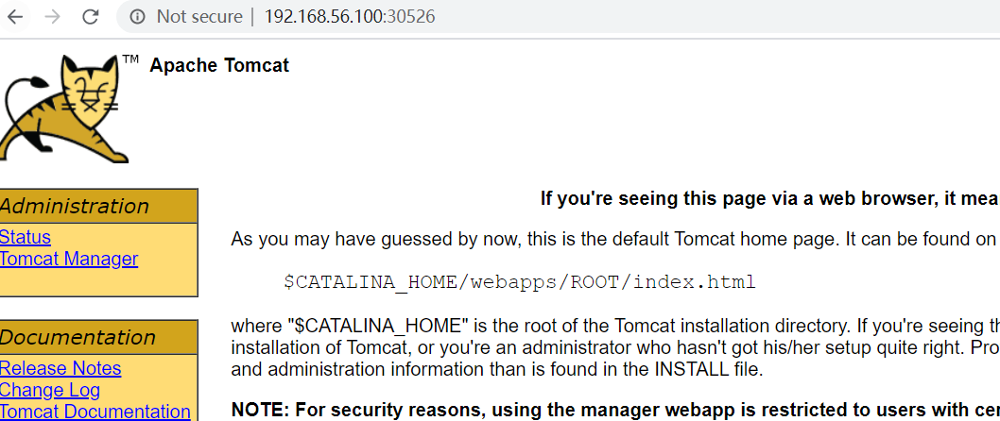


```shell
[root@k8s-node1 ~]# kubectl get all
NAME                           READY   STATUS    RESTARTS   AGE
pod/tomcat6-7b84fb5fdc-qt5jm   1/1     Running   0          13m

NAME                 TYPE        CLUSTER-IP     EXTERNAL-IP   PORT(S)        AGE
service/kubernetes   ClusterIP   10.96.0.1      <none>        443/TCP        12h
service/tomcat6      NodePort    10.96.24.191   <none>        80:30526/TCP   9m50s

NAME                      READY   UP-TO-DATE   AVAILABLE   AGE
deployment.apps/tomcat6   1/1     1            1           11h

NAME                                 DESIRED   CURRENT   READY   AGE
replicaset.apps/tomcat6-7b84fb5fdc   1         1         1       11h
[root@k8s-node1 ~]#
```


3、动态扩容测试

kubectl get deployment

```shell
[root@k8s-node1 ~]# kubectl get deployment
NAME      READY   UP-TO-DATE   AVAILABLE   AGE
tomcat6   2/2     2            2           11h
[root@k8s-node1 ~]# 
```


应用升级： kubectl set image (--help查看帮助)
扩容：kubectl scale --replicas=3 deployment tomcat6

```shell
[root@k8s-node1 ~]# kubectl scale --replicas=3 deployment tomcat6
deployment.apps/tomcat6 scaled
[root@k8s-node1 ~]# 

[root@k8s-node1 ~]# kubectl get pods -o wide
NAME                       READY   STATUS    RESTARTS   AGE   IP           NODE        NOMINATED NODE   READINESS GATES
tomcat6-7b84fb5fdc-hdgmc   1/1     Running   0          61s   10.244.2.5   k8s-node2   <none>           <none>
tomcat6-7b84fb5fdc-qt5jm   1/1     Running   0          19m   10.244.1.2   k8s-node3   <none>           <none>
tomcat6-7b84fb5fdc-vlrh6   1/1     Running   0          61s   10.244.2.4   k8s-node2   <none>           <none>
[root@k8s-node1 ~]# kubectl get svc -o wide    
NAME         TYPE        CLUSTER-IP     EXTERNAL-IP   PORT(S)        AGE   SELECTOR
kubernetes   ClusterIP   10.96.0.1      <none>        443/TCP        13h   <none>
tomcat6      NodePort    10.96.24.191   <none>        80:30526/TCP   16m   app=tomcat6
[root@k8s-node1 ~]#
```


扩容了多份，所有无论访问哪个node的指定端口，都可以访问到tomcat6

 http://192.168.56.101:30526/ 

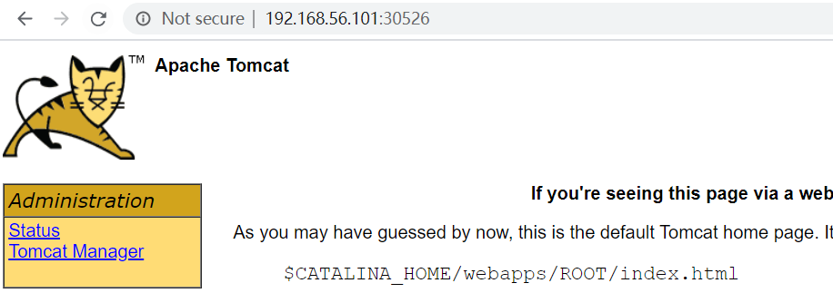

 http://192.168.56.102:30526/ 

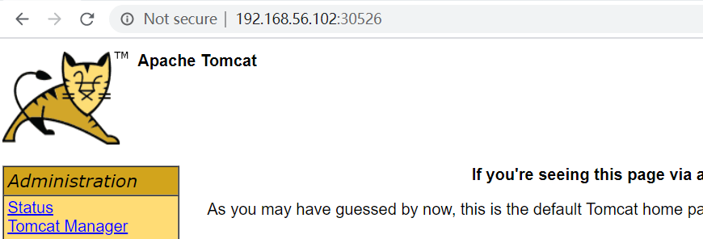


缩容：kubectl scale --replicas=2 deployment tomcat6

```
[root@k8s-node1 ~]#  kubectl scale --replicas=2 deployment tomcat6
deployment.apps/tomcat6 scaled
[root@k8s-node1 ~]# kubectl get pods -o wide                       
NAME                       READY   STATUS        RESTARTS   AGE     IP           NODE        NOMINATED NODE   READINESS GATES
tomcat6-7b84fb5fdc-hdgmc   0/1     Terminating   0          4m47s   <none>       k8s-node2   <none>           <none>
tomcat6-7b84fb5fdc-qt5jm   1/1     Running       0          22m     10.244.1.2   k8s-node3   <none>           <none>
tomcat6-7b84fb5fdc-vlrh6   1/1     Running       0          4m47s   10.244.2.4   k8s-node2   <none>           <none>
[root@k8s-node1 ~]# 
```


4、以上操作的yaml获取
参照k8s细节

5、删除
kubectl get all

```shell
#查看所有资源
[root@k8s-node1 ~]# kubectl get all
NAME                           READY   STATUS    RESTARTS   AGE
pod/tomcat6-7b84fb5fdc-qt5jm   1/1     Running   0          26m
pod/tomcat6-7b84fb5fdc-vlrh6   1/1     Running   0          8m16s

NAME                 TYPE        CLUSTER-IP     EXTERNAL-IP   PORT(S)        AGE
service/kubernetes   ClusterIP   10.96.0.1      <none>        443/TCP        13h
service/tomcat6      NodePort    10.96.24.191   <none>        80:30526/TCP   22m

NAME                      READY   UP-TO-DATE   AVAILABLE   AGE
deployment.apps/tomcat6   2/2     2            2           11h

NAME                                 DESIRED   CURRENT   READY   AGE
replicaset.apps/tomcat6-7b84fb5fdc   2         2         2       11h
[root@k8s-node1 ~]#
#删除deployment.apps/tomcat6 
[root@k8s-node1 ~]# kubectl delete  deployment.apps/tomcat6 
deployment.apps "tomcat6" deleted

#查看剩余的资源
[root@k8s-node1 ~]# kubectl get all   
NAME                 TYPE        CLUSTER-IP     EXTERNAL-IP   PORT(S)        AGE
service/kubernetes   ClusterIP   10.96.0.1      <none>        443/TCP        13h
service/tomcat6      NodePort    10.96.24.191   <none>        80:30526/TCP   30m
[root@k8s-node1 ~]# 
[root@k8s-node1 ~]#
#删除service/tomcat6 
[root@k8s-node1 ~]# kubectl delete service/tomcat6  
service "tomcat6" deleted
[root@k8s-node1 ~]# kubectl get all
NAME                 TYPE        CLUSTER-IP   EXTERNAL-IP   PORT(S)   AGE
service/kubernetes   ClusterIP   10.96.0.1    <none>        443/TCP   13h
[root@k8s-node1 ~]#

```


kubectl delete deploye/nginx
kubectl delete service/nginx-service


## 3、K8s细节

### 1、kubectl文档

​    https://kubernetes.io/zh/docs/reference/kubectl/overview/

### 2、资源类型

   https://kubernetes.io/zh/docs/reference/kubectl/overview/#%e8%b5%84%e6%ba%90%e7%b1%bb%e5%9e%8b


### 3、格式化输出

 https://kubernetes.io/zh/docs/reference/kubectl/overview/ 

>
>
>所有 `kubectl` 命令的默认输出格式都是人类可读的纯文本格式。要以特定格式向终端窗口输出详细信息，可以将 `-o` 或 `--output` 参数添加到受支持的 `kubectl` 命令中。
>
>#### 语法
>
>```shell
>kubectl [command] [TYPE] [NAME] -o=<output_format>
>```
>
>根据 `kubectl` 操作，支持以下输出格式：
>
>| Output format             | Description                                                  |
>| :------------------------ | :----------------------------------------------------------- |
>| `-o custom-columns=`      | 使用逗号分隔的[自定义列](https://kubernetes.io/zh/docs/reference/kubectl/overview/#custom-columns)列表打印表。 |
>| `-o custom-columns-file=` | 使用 `` 文件中的[自定义列](https://kubernetes.io/zh/docs/reference/kubectl/overview/#custom-columns)模板打印表。 |
>| `-o json`                 | 输出 JSON 格式的 API 对象                                    |
>| `-o jsonpath=             | 打印 [jsonpath](https://kubernetes.io/docs/reference/kubectl/jsonpath/) 表达式定义的字段 |
>| `-o jsonpath-file=`       | 打印 `` 文件中 [jsonpath](https://kubernetes.io/docs/reference/kubectl/jsonpath/) 表达式定义的字段。 |
>| `-o name`                 | 仅打印资源名称而不打印任何其他内容。                         |
>| `-o wide`                 | 以纯文本格式输出，包含任何附加信息。对于 pod 包含节点名。    |
>| `-o yaml`                 | 输出 YAML 格式的 API 对象。                                  |
>
>##### 示例
>
>在此示例中，以下命令将单个 pod 的详细信息输出为 YAML 格式的对象：
>
>```shell
>kubectl get pod web-pod-13je7 -o yaml
>```
>
>请记住：有关每个命令支持哪种输出格式的详细信息，请参阅 [kubectl](https://kubernetes.io/docs/user-guide/kubectl/) 参考文档。


--dry-run：

>
>
> --dry-run='none': Must be "none", "server", or "client". If client strategy, only print the object that would be
>
>sent, without sending it. If server strategy, submit server-side request without persisting the resource.
>
>值必须为none，server或client。如果是客户端策略，则只打印该发送对象，但不发送它。如果服务器策略，提交服务器端请求而不持久化资源。
>
>也就是说，通过--dry-run选项，并不会真正的执行这条命令。


```yaml
[root@k8s-node1 ~]# kubectl create deployment tomcat6 --image=tomcat:6.0.53-jre8 --dry-run -o yaml
W0504 03:39:08.389369    8107 helpers.go:535] --dry-run is deprecated and can be replaced with --dry-run=client.
apiVersion: apps/v1
kind: Deployment
metadata:
  creationTimestamp: null
  labels:
    app: tomcat6
  name: tomcat6
spec:
  replicas: 1
  selector:
    matchLabels:
      app: tomcat6
  strategy: {}
  template:
    metadata:
      creationTimestamp: null
      labels:
        app: tomcat6
    spec:
      containers:
      - image: tomcat:6.0.53-jre8
        name: tomcat
        resources: {}
status: {}
[root@k8s-node1 ~]# 
```

实际上我们也可以将这个yaml输出到文件，然后使用kubectl apply -f来应用它

```shell
#输出到tomcat6.yaml 
[root@k8s-node1 ~]# kubectl create deployment tomcat6 --image=tomcat:6.0.53-jre8 --dry-run -o yaml >tomcat6.yaml
W0504 03:46:18.180366   11151 helpers.go:535] --dry-run is deprecated and can be replaced with --dry-run=client.

#修改副本数为3
[root@k8s-node1 ~]# cat tomcat6.yaml 
apiVersion: apps/v1
kind: Deployment
metadata:
  creationTimestamp: null
  labels:
    app: tomcat6
  name: tomcat6
spec:
  replicas: 3     #修改副本数为3
  selector:
    matchLabels:
      app: tomcat6
  strategy: {}
  template:
    metadata:
      creationTimestamp: null
      labels:
        app: tomcat6
    spec:
      containers:
      - image: tomcat:6.0.53-jre8
        name: tomcat
        resources: {}
status: {}

#应用tomcat6.yaml 
[root@k8s-node1 ~]# kubectl apply -f tomcat6.yaml 
deployment.apps/tomcat6 created
[root@k8s-node1 ~]# 
```

查看pods：

```shell
[root@k8s-node1 ~]# kubectl get pods  
NAME                       READY   STATUS    RESTARTS   AGE
tomcat6-7b84fb5fdc-5jh6t   1/1     Running   0          8s
tomcat6-7b84fb5fdc-8lhwv   1/1     Running   0          8s
tomcat6-7b84fb5fdc-j4qmh   1/1     Running   0          8s
[root@k8s-node1 ~]#
```


查看某个pod的具体信息：

```shell
[root@k8s-node1 ~]# kubectl get pods tomcat6-7b84fb5fdc-5jh6t  -o yaml
```

```yaml

apiVersion: v1
kind: Pod
metadata:
  creationTimestamp: "2020-05-04T03:50:47Z"
  generateName: tomcat6-7b84fb5fdc-
  labels:
    app: tomcat6
    pod-template-hash: 7b84fb5fdc
  managedFields:
  - apiVersion: v1
    fieldsType: FieldsV1
    fieldsV1:
      f:metadata:
        f:generateName: {}
        f:labels:
          .: {}
          f:app: {}
          f:pod-template-hash: {}
        f:ownerReferences:
          .: {}
          k:{"uid":"292bfe3b-dd63-442e-95ce-c796ab5bdcc1"}:
            .: {}
            f:apiVersion: {}
            f:blockOwnerDeletion: {}
            f:controller: {}
            f:kind: {}
            f:name: {}
            f:uid: {}
      f:spec:
        f:containers:
          k:{"name":"tomcat"}:
            .: {}
            f:image: {}
            f:imagePullPolicy: {}
            f:name: {}
            f:resources: {}
            f:terminationMessagePath: {}
            f:terminationMessagePolicy: {}
        f:dnsPolicy: {}
        f:enableServiceLinks: {}
        f:restartPolicy: {}
        f:schedulerName: {}
        f:securityContext: {}
        f:terminationGracePeriodSeconds: {}
    manager: kube-controller-manager
    operation: Update
    time: "2020-05-04T03:50:47Z"
  - apiVersion: v1
    fieldsType: FieldsV1
    fieldsV1:
      f:status:
        f:conditions:
          k:{"type":"ContainersReady"}:
            .: {}
            f:lastProbeTime: {}
            f:lastTransitionTime: {}
            f:status: {}
            f:type: {}
          k:{"type":"Initialized"}:
            .: {}
            f:lastProbeTime: {}
            f:lastTransitionTime: {}
            f:status: {}
            f:type: {}
          k:{"type":"Ready"}:
            .: {}
            f:lastProbeTime: {}
            f:lastTransitionTime: {}
            f:status: {}
            f:type: {}
        f:containerStatuses: {}
        f:hostIP: {}
        f:phase: {}
        f:podIP: {}
        f:podIPs:
          .: {}
          k:{"ip":"10.244.2.7"}:
            .: {}
            f:ip: {}
        f:startTime: {}
    manager: kubelet
    operation: Update
    time: "2020-05-04T03:50:49Z"
  name: tomcat6-7b84fb5fdc-5jh6t
  namespace: default
  ownerReferences:
  - apiVersion: apps/v1
    blockOwnerDeletion: true
    controller: true
    kind: ReplicaSet
    name: tomcat6-7b84fb5fdc
    uid: 292bfe3b-dd63-442e-95ce-c796ab5bdcc1
  resourceVersion: "46229"
  selfLink: /api/v1/namespaces/default/pods/tomcat6-7b84fb5fdc-5jh6t
  uid: 2f661212-3b03-47e4-bcb8-79782d5c7578
spec:
  containers:
  - image: tomcat:6.0.53-jre8
    imagePullPolicy: IfNotPresent
    name: tomcat
    resources: {}
    terminationMessagePath: /dev/termination-log
    terminationMessagePolicy: File
    volumeMounts:
    - mountPath: /var/run/secrets/kubernetes.io/serviceaccount
      name: default-token-bxqtw
      readOnly: true
  dnsPolicy: ClusterFirst
  enableServiceLinks: true
  nodeName: k8s-node2
  priority: 0
  restartPolicy: Always
  schedulerName: default-scheduler
  securityContext: {}
  serviceAccount: default
  serviceAccountName: default
  terminationGracePeriodSeconds: 30
  tolerations:
  - effect: NoExecute
    key: node.kubernetes.io/not-ready
    operator: Exists
    tolerationSeconds: 300
  - effect: NoExecute
    key: node.kubernetes.io/unreachable
    operator: Exists
    tolerationSeconds: 300
  volumes:
  - name: default-token-bxqtw
    secret:
      defaultMode: 420
      secretName: default-token-bxqtw
status:
  conditions:
  - lastProbeTime: null
    lastTransitionTime: "2020-05-04T03:50:47Z"
    status: "True"
    type: Initialized
  - lastProbeTime: null
    lastTransitionTime: "2020-05-04T03:50:49Z"
    status: "True"
    type: Ready
  - lastProbeTime: null
    lastTransitionTime: "2020-05-04T03:50:49Z"
    status: "True"
    type: ContainersReady
  - lastProbeTime: null
    lastTransitionTime: "2020-05-04T03:50:47Z"
    status: "True"
    type: PodScheduled
  containerStatuses:
  - containerID: docker://18eb0798384ea44ff68712cda9be94b6fb96265206c554a15cee28c288879304
    image: tomcat:6.0.53-jre8
    imageID: docker-pullable://tomcat@sha256:8c643303012290f89c6f6852fa133b7c36ea6fbb8eb8b8c9588a432beb24dc5d
    lastState: {}
    name: tomcat
    ready: true
    restartCount: 0
    started: true
    state:
      running:
        startedAt: "2020-05-04T03:50:49Z"
  hostIP: 10.0.2.4
  phase: Running
  podIP: 10.244.2.7
  podIPs:
  - ip: 10.244.2.7
  qosClass: BestEffort
  startTime: "2020-05-04T03:50:47Z"
```


### 命令参考


### service的意义


前面我们通过命令行的方式，部署和暴露了tomcat，实际上也可以通过yaml的方式来完成这些操作。

```shell
#这些操作实际上是为了获取Deployment的yaml模板
[root@k8s-node1 ~]#  kubectl create deployment tomcat6 --image=tomcat:6.0.53-jre8 --dry-run -o yaml >tomcat6-deployment.yaml
W0504 04:13:28.265432   24263 helpers.go:535] --dry-run is deprecated and can be replaced with --dry-run=client.
[root@k8s-node1 ~]# ls tomcat6-deployment.yaml
tomcat6-deployment.yaml
[root@k8s-node1 ~]# 
```

修改“tomcat6-deployment.yaml”内容如下：

```yaml
apiVersion: apps/v1
kind: Deployment
metadata:
  labels:
    app: tomcat6
  name: tomcat6
spec:
  replicas: 3
  selector:
    matchLabels:
      app: tomcat6
  template:
    metadata: 
      labels:
        app: tomcat6
    spec:
      containers:
      - image: tomcat:6.0.53-jre8
        name: tomcat
```


```shell
#部署
[root@k8s-node1 ~]# kubectl apply -f tomcat6-deployment.yaml
deployment.apps/tomcat6 configured


#查看资源
[root@k8s-node1 ~]# kubectl get all
NAME                           READY   STATUS    RESTARTS   AGE
pod/tomcat6-7b84fb5fdc-5jh6t   1/1     Running   0          27m
pod/tomcat6-7b84fb5fdc-8lhwv   1/1     Running   0          27m
pod/tomcat6-7b84fb5fdc-j4qmh   1/1     Running   0          27m

NAME                 TYPE        CLUSTER-IP   EXTERNAL-IP   PORT(S)   AGE
service/kubernetes   ClusterIP   10.96.0.1    <none>        443/TCP   14h

NAME                      READY   UP-TO-DATE   AVAILABLE   AGE
deployment.apps/tomcat6   3/3     3            3           27m

NAME                                 DESIRED   CURRENT   READY   AGE
replicaset.apps/tomcat6-7b84fb5fdc   3         3         3       27m
[root@k8s-node1 ~]#
```


```shell
kubectl expose deployment tomcat6 --port=80 --target-port=8080 --type=NodePort  --dry-run -o yaml
```

```yaml
apiVersion: v1
kind: Service
metadata:
  creationTimestamp: null
  labels:
    app: tomcat6
  name: tomcat6
spec:
  ports:
  - port: 80
    protocol: TCP
    targetPort: 8080
  selector:
    app: tomcat6
  type: NodePort
status:
  loadBalancer: {}
```


将这段输出和“tomcat6-deployment.yaml”进行拼接，表示部署完毕并进行暴露服务：

```yaml
apiVersion: apps/v1
kind: Deployment
metadata:
  labels:
    app: tomcat6
  name: tomcat6
spec:
  replicas: 3
  selector:
    matchLabels:
      app: tomcat6
  template:
    metadata: 
      labels:
        app: tomcat6
    spec:
      containers:
      - image: tomcat:6.0.53-jre8
        name: tomcat
---
apiVersion: v1
kind: Service
metadata:
  creationTimestamp: null
  labels:
    app: tomcat6
  name: tomcat6
spec:
  ports:
  - port: 80
    protocol: TCP
    targetPort: 8080
  selector:
    app: tomcat6
  type: NodePort
```


部署并暴露服务

```shell
[root@k8s-node1 ~]# kubectl apply -f tomcat6-deployment.yaml
deployment.apps/tomcat6 created
service/tomcat6 created
```

查看服务和部署信息

```shell
[root@k8s-node1 ~]# kubectl get all
NAME                           READY   STATUS    RESTARTS   AGE
pod/tomcat6-7b84fb5fdc-dsqmb   1/1     Running   0          4s
pod/tomcat6-7b84fb5fdc-gbmxc   1/1     Running   0          5s
pod/tomcat6-7b84fb5fdc-kjlc6   1/1     Running   0          4s

NAME                 TYPE        CLUSTER-IP      EXTERNAL-IP   PORT(S)        AGE
service/kubernetes   ClusterIP   10.96.0.1       <none>        443/TCP        14h
service/tomcat6      NodePort    10.96.147.210   <none>        80:30172/TCP   4s

NAME                      READY   UP-TO-DATE   AVAILABLE   AGE
deployment.apps/tomcat6   3/3     3            3           5s

NAME                                 DESIRED   CURRENT   READY   AGE
replicaset.apps/tomcat6-7b84fb5fdc   3         3         3       5s
[root@k8s-node1 ~]#
```

访问node1，node1和node3的30172端口：

```shell
[root@k8s-node1 ~]# curl -I http://192.168.56.{100,101,102}:30172/
HTTP/1.1 200 OK
Server: Apache-Coyote/1.1
Accept-Ranges: bytes
ETag: W/"7454-1491118183000"
Last-Modified: Sun, 02 Apr 2017 07:29:43 GMT
Content-Type: text/html
Content-Length: 7454
Date: Mon, 04 May 2020 04:35:35 GMT

HTTP/1.1 200 OK
Server: Apache-Coyote/1.1
Accept-Ranges: bytes
ETag: W/"7454-1491118183000"
Last-Modified: Sun, 02 Apr 2017 07:29:43 GMT
Content-Type: text/html
Content-Length: 7454
Date: Mon, 04 May 2020 04:35:35 GMT

HTTP/1.1 200 OK
Server: Apache-Coyote/1.1
Accept-Ranges: bytes
ETag: W/"7454-1491118183000"
Last-Modified: Sun, 02 Apr 2017 07:29:43 GMT
Content-Type: text/html
Content-Length: 7454
Date: Mon, 04 May 2020 04:35:35 GMT

[root@k8s-node1 ~]# 
```


### Ingress

通过Ingress发现pod进行关联。基于域名访问
通过Ingress controller实现POD负载均衡
支持TCP/UDP 4层负载均衡和HTTP 7层负载均衡


步骤：
（1）部署Ingress controller

ingress是对nginx的封装，是安装到每个节点(node)上。

执行“k8s/ingress-controller.yaml”

```shell
[root@k8s-node1 k8s]# kubectl apply -f ingress-controller.yaml 
namespace/ingress-nginx created
configmap/nginx-configuration created
configmap/tcp-services created
configmap/udp-services created
serviceaccount/nginx-ingress-serviceaccount created
clusterrole.rbac.authorization.k8s.io/nginx-ingress-clusterrole created
role.rbac.authorization.k8s.io/nginx-ingress-role created
rolebinding.rbac.authorization.k8s.io/nginx-ingress-role-nisa-binding created
clusterrolebinding.rbac.authorization.k8s.io/nginx-ingress-clusterrole-nisa-binding created
daemonset.apps/nginx-ingress-controller created
service/ingress-nginx created
[root@k8s-node1 k8s]# 
```


查看，两个nginx-ingress-controller是安装到两个node节点上。

```shell
[root@k8s-node1 k8s]# kubectl get pods --all-namespaces
NAMESPACE       NAME                                READY   STATUS              RESTARTS   AGE
default         tomcat6-7b84fb5fdc-dsqmb            1/1     Running             0          16m
default         tomcat6-7b84fb5fdc-gbmxc            1/1     Running             0          16m
default         tomcat6-7b84fb5fdc-kjlc6            1/1     Running             0          16m
ingress-nginx   nginx-ingress-controller-9q6cs      0/1     ContainerCreating   0          40s
ingress-nginx   nginx-ingress-controller-qx572      0/1     ContainerCreating   0          40s
kube-system     coredns-546565776c-9sbmk            1/1     Running             1          14h
kube-system     coredns-546565776c-t68mr            1/1     Running             1          14h
kube-system     etcd-k8s-node1                      1/1     Running             1          14h
kube-system     kube-apiserver-k8s-node1            1/1     Running             1          14h
kube-system     kube-controller-manager-k8s-node1   1/1     Running             1          14h
kube-system     kube-flannel-ds-amd64-5xs5j         1/1     Running             2          13h
kube-system     kube-flannel-ds-amd64-6xwth         1/1     Running             2          14h
kube-system     kube-flannel-ds-amd64-fvnvx         1/1     Running             1          13h
kube-system     kube-proxy-7tkvl                    1/1     Running             1          13h
kube-system     kube-proxy-mvlnk                    1/1     Running             2          13h
kube-system     kube-proxy-sz2vz                    1/1     Running             1          14h
kube-system     kube-scheduler-k8s-node1            1/1     Running             1          14h
[root@k8s-node1 k8s]#
```

这里master节点负责调度，具体执行交给node2和node3来完成，能够看到它们正在下载镜像


（2）创建Ingress规则

```yaml
apiVersion: extensions/v1beta1
kind: Ingress
metadata:
  name: web
spec:
  rules:
  - host: tomcat6.kubenetes.com
    http:
       paths: 
          - backend: 
              serviceName: tomcat6
              servicePort: 80
```


```shell
[root@k8s-node1 k8s]# touch ingress-tomcat6.yaml
#将上面的规则，添加到ingress-tomcat6.yaml文件中
[root@k8s-node1 k8s]# vi  ingress-tomcat6.yaml  
 
[root@k8s-node1 k8s]# kubectl apply -f ingress-tomcat6.yaml 
ingress.extensions/web created
[root@k8s-node1 k8s]# 
```

修改本机的hosts文件，添加如下的域名转换规则：

```
192.168.56.102 tomcat6.kubenetes.com
```


测试: http://tomcat6.kubenetes.com/ 


并且集群中即便有一个节点不可用，也不影响整体的运行。


## 安装kubernetes可视化界面——DashBoard

1、部署DashBoard

```shell
$ kubectl appy -f  kubernetes-dashboard.yaml
```

 文件在“k8s”源码目录提供

2、暴露DashBoard为公共访问

默认DashBoard只能集群内部访问，修改Service为NodePort类型，暴露到外部

```yaml
kind: Service
apiVersion: v1
metadata:
  labels:
    k8s-app: kubernetes-dashboard
  name: kubernetes-dashboard
  namespace: kube-system
spec:
  type: NodePort
  ports:
    - port: 443
      targetPort: 8443
      nodePort: 3001
  selector:
    k8s-app: kubernetes-dashboard
```

访问地址：http://NodeIP:30001


3、创建授权账号

```
$ kubectl create serviceaccount dashboar-admin -n kube-sysem
```

```
$ kubectl create clusterrolebinding dashboar-admin --clusterrole=cluter-admin --serviceaccount=kube-system:dashboard-admin
```

```
$ kubectl describe secrets -n kube-system $( kubectl -n kube-system get secret |awk '/dashboard-admin/{print $1}' )
```

使用输出的token登录dashboard


## kubesphere

默认的dashboard没啥用，我们用kubesphere可以打通全部的devops链路，kubesphere集成了很多套件，集群要求比较高
https://kubesphere.io

kuboard也很不错，集群要求不高
https://kuboard.cn/support/

### 1、简洁

kubesphere是一款面向云原声设计的开源项目，在目前主流容器调度平台kubernets智商构建的分布式多用户容器管理平台，提供简单易用的操作界面以及向导式操作方式，在降低用户使用容器调度平台学习成本的同时，极大降低开发、测试、运维的日常工作的复杂度。

### 2、安装前提提交


#### 1、安装helm（master节点执行）

helm是kubernetes的包管理器。包管理器类似于在Ubuntu中使用的apt，centos中的yum或者python中的pip一样，能够快速查找，下载和安装软件包。Helm有客户端组件helm和服务端组件Tiller组成，能够将一组K8S资源打包统一管理，是查找、共享和使用为Kubernetes构建的软件的最佳方式。

1）安装

```
curl -L0 https://github.com/helm/helm/releases/tag/v2.16.3
tar -zxvf helm-v2.16.2-linux-amd64.tar.gz
cd linux-amd64 && mv helm /usr/bin/helm version
helm version
Client: &version.Version{SemVer:"v2.16.3", GitCommit:"dd2e5695da88625b190e6b22e9542550ab503a47", GitTreeState:"clean"}
安装Tiller
https://blog.csdn.net/Thomson_tian/article/details/104488986/
kubectl create serviceaccount --namespace kube-system tiller
kubectl create clusterrolebinding tiller-cluster-rule --clusterrole=cluster-admin --serviceaccount=kube-system:tiller
docker pull registry.cn-hangzhou.aliyuncs.com/google_containers/tiller:v2.16.3
helm init --service-account tiller --tiller-image  registry.cn-hangzhou.aliyuncs.com/google_containers/tiller:v2.16.3 --skip-refresh 
```

由于被墙的原因，使用我们给定的get_helm.sh。

2）验证版本，务必是2.16.3，否则后面安装会失败。

```
helm version
```

3）创建权限（master执行）

创建helm-rbac.yaml，写入如下内容

```yaml
apiVersion: v1
kind: ServiceAccount
metadata:
  name: tiller
  namespace: kube-system
---
apiVersion: rbac.authorization.k8s.io/v1
kind: ClusterRoleBinding
metadata:
  name: tiller
roleRef:
  apiGroup: rbac.authorization.k8s.io
  kind: ClusterRole
  name: cluster-admin
subjects:
  - kind: ServiceAccount
    name: kubernetes-dashboard
    namespace: kube-system
```

应用配置：

```shell
[root@k8s-node1 k8s]#  kubectl apply -f helm-rbac.yaml
serviceaccount/tiller created
clusterrolebinding.rbac.authorization.k8s.io/tiller created
[root@k8s-node1 k8s]#
```


#### 2、安装Tilller（Master执行）

1、初始化

```shell
[root@k8s-node1 k8s]# helm init --service-account=tiller --tiller-image=sapcc/tiller:v2.16.3 --history-max 300 
Creating /root/.helm 
Creating /root/.helm/repository 
Creating /root/.helm/repository/cache 
Creating /root/.helm/repository/local 
Creating /root/.helm/plugins 
Creating /root/.helm/starters 
Creating /root/.helm/cache/archive 
Creating /root/.helm/repository/repositories.yaml 
Adding stable repo with URL: https://kubernetes-charts.storage.googleapis.com 
Adding local repo with URL: http://127.0.0.1:8879/charts 
$HELM_HOME has been configured at /root/.helm.

Tiller (the Helm server-side component) has been installed into your Kubernetes Cluster.

Please note: by default, Tiller is deployed with an insecure 'allow unauthenticated users' policy.
To prevent this, run `helm init` with the --tiller-tls-verify flag.
For more information on securing your installation see: https://v2.helm.sh/docs/securing_installation/
[root@k8s-node1 k8s]# 
```

--tiller-image 指定镜像，否则会被墙，等待节点上部署的tiller完成即可。

`helm version`客户端和服务端版本要一致，否则重新安装 

>helm v2.16.3跟kubesphere2.1版本和k8s v1.17.3 兼容，否则后面安装kubesphere会出错

```shell
Client: &version.Version{SemVer:"v2.16.3", GitCommit:"a690bad98af45b015bd3da1a41f6218b1a451dbe", GitTreeState:"clean"}
Server: &version.Version{SemVer:"v2.16.3", GitCommit:"a690bad98af45b015bd3da1a41f6218b1a451dbe", GitTreeState:"clean"}
```

重新安装

```shell

curl -L0 https://github.com/helm/helm/releases/tag/v2.16.3
tar -zxvf helm-v2.16.2-linux-amd64.tar.gz
cd linux-amd64 && mv helm /usr/bin/helm version
helm version
Client: &version.Version{SemVer:"v2.16.3", GitCommit:"dd2e5695da88625b190e6b22e9542550ab503a47", GitTreeState:"clean"}
安装Tiller
https://blog.csdn.net/Thomson_tian/article/details/104488986/
kubectl create serviceaccount --namespace kube-system tiller
kubectl create clusterrolebinding tiller-cluster-rule --clusterrole=cluster-admin --serviceaccount=kube-system:tiller
docker pull registry.cn-hangzhou.aliyuncs.com/google_containers/tiller:v2.16.6
helm init --service-account tiller --tiller-image  registry.cn-hangzhou.aliyuncs.com/google_containers/tiller:v2.16.6 --skip-refresh 
```


```shell
[root@k8s-node1 k8s]#  kubectl get pods -n kube-system
NAME                                   READY   STATUS             RESTARTS   AGE
coredns-546565776c-9sbmk               1/1     Running            3          23h
coredns-546565776c-t68mr               1/1     Running            3          23h
etcd-k8s-node1                         1/1     Running            3          23h
kube-apiserver-k8s-node1               1/1     Running            3          23h
kube-controller-manager-k8s-node1      1/1     Running            3          23h
kube-flannel-ds-amd64-5xs5j            1/1     Running            4          22h
kube-flannel-ds-amd64-6xwth            1/1     Running            5          23h
kube-flannel-ds-amd64-fvnvx            1/1     Running            4          22h
kube-proxy-7tkvl                       1/1     Running            3          22h
kube-proxy-mvlnk                       1/1     Running            4          22h
kube-proxy-sz2vz                       1/1     Running            3          23h
kube-scheduler-k8s-node1               1/1     Running            3          23h
kubernetes-dashboard-975499656-jxczv   0/1     ImagePullBackOff   0          7h45m
tiller-deploy-8cc566858-67bxb          1/1     Running            0          31s
[root@k8s-node1 k8s]#
```

查看污点

```shell
[root@k8s-node1 k8s]# kubectl describe node k8s-node1 | grep Taint
Taints:             node-role.kubernetes.io/master:NoSchedule
#去掉污点
[root@k8s-node1 k8s]# kubectl taint nodes k8s-node1 node-role.kubernetes.io/master:NoSchedule-
node/k8s-node1 untainted
```

安装OpenSE

```shell
kubectl create ns openebs
 kubectl apply -f https://openebs.github.io/charts/openebs-operator-1.5.0.yaml
 如果有的镜像不能下载，重启一下节点node机器，会重新下载。
 设置默认的StorageClass
 将 master 节点 Taint 加上
```


查看集群的所有节点信息：

```
 kubectl get node -o wide
```

```shell

[root@k8s-node1 k8s]#  kubectl get node -o wide
NAME        STATUS   ROLES    AGE   VERSION   INTERNAL-IP   EXTERNAL-IP   OS-IMAGE                KERNEL-VERSION               CONTAINER-RUNTIME
k8s-node1   Ready    master   23h   v1.17.3   10.0.2.15     <none>        CentOS Linux 7 (Core)   3.10.0-957.12.2.el7.x86_64   docker://19.3.8
k8s-node2   Ready    <none>   22h   v1.17.3   10.0.2.4      <none>        CentOS Linux 7 (Core)   3.10.0-957.12.2.el7.x86_64   docker://19.3.8
k8s-node3   Ready    <none>   22h   v1.17.3   10.0.2.5      <none>        CentOS Linux 7 (Core)   3.10.0-957.12.2.el7.x86_64   docker://19.3.8
[root@k8s-node1 k8s]# 
```


2、测试

```
helm install stable/nginx-ingress --name nginx-ingress
```


最小化安装 KubeSphere

若集群可用 CPU > 1 Core 且可用内存 > 2 G，可以使用以下命令最小化安装 KubeSphere：

https://github.com/kubesphere/ks-installer

https://github.com/kubesphere/ks-installer/blob/v2.1.1/kubesphere-minimal.yaml

将上面的yaml拷贝到本地执行`kubectl apply -f kubesphere-min-setup-2-1-1.yaml`，进行最小化安装

监控安装过程

1. 查看滚动刷新的安装日志，请耐心等待安装成功。

```bash
kubectl logs -n kubesphere-system $(kubectl get pod -n kubesphere-system -l app=ks-install -o jsonpath='{.items[0].metadata.name}') -f
```

> 说明：安装过程中若遇到问题，也可以通过以上日志命令来排查问题。
>
> 备注：安装方法是，在k8s里安装了一个Pod，安装器，进行安装kubesphere
>
> kubectl get pod --all-namespaces
> kubesphere-system   ks-installer-75b8d89dff-qntp9                  1/1     Running   0          2m50s
>
> 如果安装失败，删除installer，再安装
>
> kubectl delete pod ks-installer-75b8d89dff-gfznb -n kubesphere-system
>
> kubectl delete pod redis-6fd6c6d6f9-dllht  -n kubesphere-system

​	2.安装成功 ，用户名 密码

> Console: http://192.168.137.100:30880/login
>
> Account: admin
> Password: P@88w0rd
>
> 密码修改为：0987Poiu

```shell
删除节点：
（1）卸载节点（drain 翻译排出，此时卸载节点，但是没有删除）
kubectl drain k8s-node3 --delete-local-data --force --ignore-daemonsets
（2）删除节点
kubectl delete node k8s-node3
（3）清空init配置，需要删除的节点上执行
kubeadm reset
```


#### 3、安装其他功能

扩展node2内存8G,CPU 5核

```bash
kubectl edit cm -n kubesphere-system ks-installer
将Devops，Notice，alert从False->True
```

#### 4、多租户管理

https://v2-1.docs.kubesphere.io/docs/zh-CN/quick-start/admin-quick-start/

#### 5、创建WordPress

1. 创建wordpress和mysql秘钥

2. 创建wordpress和mysql存储卷（PVC）

3. 创建应用 （数据库，redis，文件等都是有状态服务）

4. 设置外网访问   **80:32207/TCP**

   http://192.168.137.100:32207/  用户名wh,密码 0987Poiu

## DevOps

#### 1、项目开发需要考虑的维度

Dev：怎么开发？

Ops：怎么运维?

高并发：怎样承担高并发

高可用：怎么做到高可用

#### 2、什么是CI&CD


##### 1、持续集成（CI）

+ 全面自动化测试，选择合适的自动化测试工具
+ 版本控制机制，如Git，SVN
+ 自动化的构建与软件发布流程的工具，如Jenkins

##### 2、持续交付（CD）

将集成测试后的代码部署到更贴近真实运行环境的【类生产环境(UAT)】,建立在高水平自动化集成之上，灰度发布等

+ 快速发布
+ 编码->测试->上线->交付的频繁迭代周期缩短，同时获得快速反馈。
+ 高质量软件发布标准
+ 整个交付过程进度可视化
+ 更先进的团队协作

##### 3、持续部署(CD)

当交付的代码通过评审后，自动部署到生产环境。

> 开发人员提交代码，持续集成服务器获取代码，执行单元测试，根据测试结果决定是否部署到测试环境，如果成功部署到测试环境，进行整体验收测试，如果测试通过，自动部署到产品环境，全程自动化高效运转。

#### 3、基于Spring Boot项目构建流水线

#### 1、创建GitHub，DockerHub，sonarQube的凭证

+ GitHub，DockerHub凭证安装

+ sonarQube凭证安装(后面的Jenkinsfile-online已经去掉了sonarQube的代码分析，所以这个凭证不做也可以)

  ```
  kubectl get svc --all-namespaces
  kubesphere-devops-system       ks-sonarqube-sonarqube             NodePort    10.96.233.101   <none>        9000:30042/TCP           3m
  sonarQube：http://192.168.137.100:30042/about  
  admin/admin
生成token:5b54f32d58ea04a86a7d7d1f179452d93686e872
  ```

+ `fork` 工程[devops-java-sample](https://github.com/Dongdonghe1981/devops-java-sample)，修改`Jenkinsfile-online`文件。

+ 在devops工程下，创建流水线

  - 配置跟github工程的webhook，推送到本地kubesphere的时候，需要配置一下内网穿透

    https://www.ngrok.cc/tunnel

    C:\Windows\System32\cmd.exe

    sunny clientid c8c08f14f4007072

    C:\Users\HP\Downloads\ngrok-stable-windows-amd64
    
    host 修改  192.168.137.100 kubesphere.local
    
    打开ngrok, 运行 ngrok http kubesphere.local:30880
    
    https://blog.csdn.net/arrizo/article/details/105498605

​              sunny clientid c8c08f14f4007072